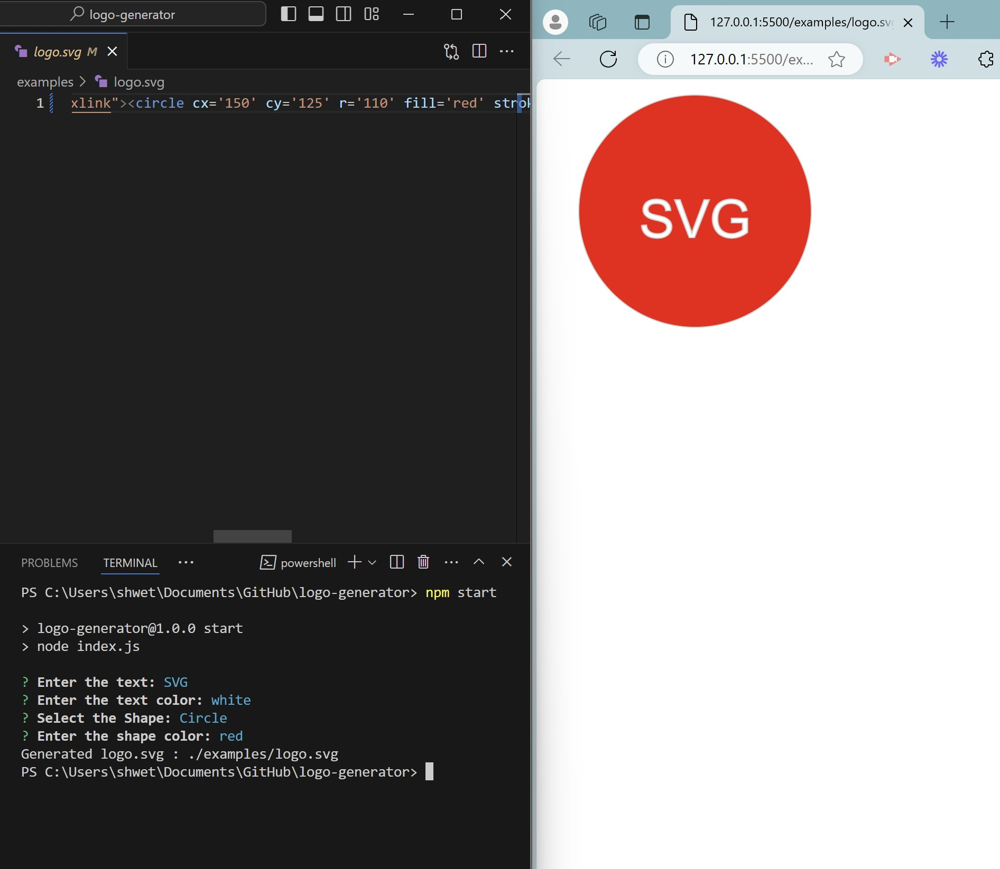
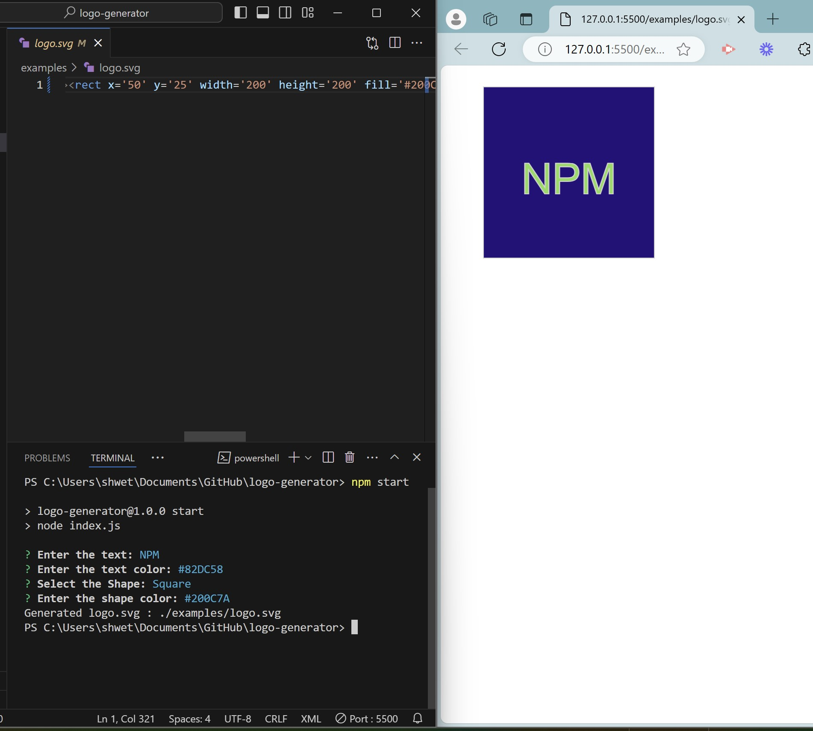
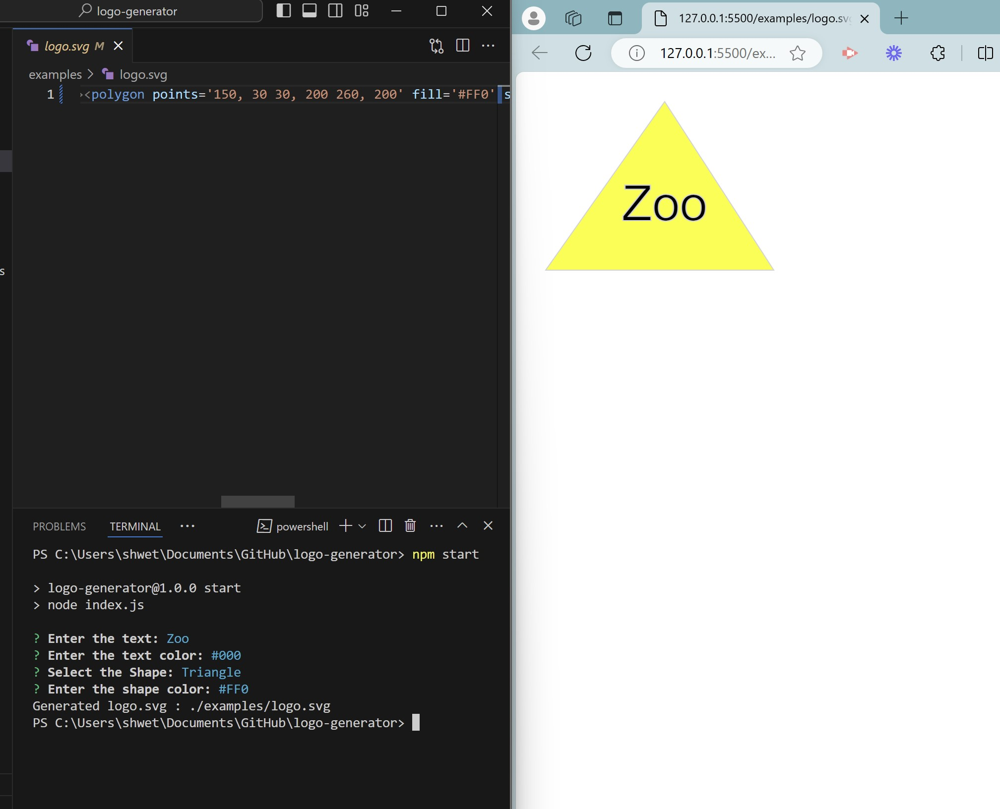
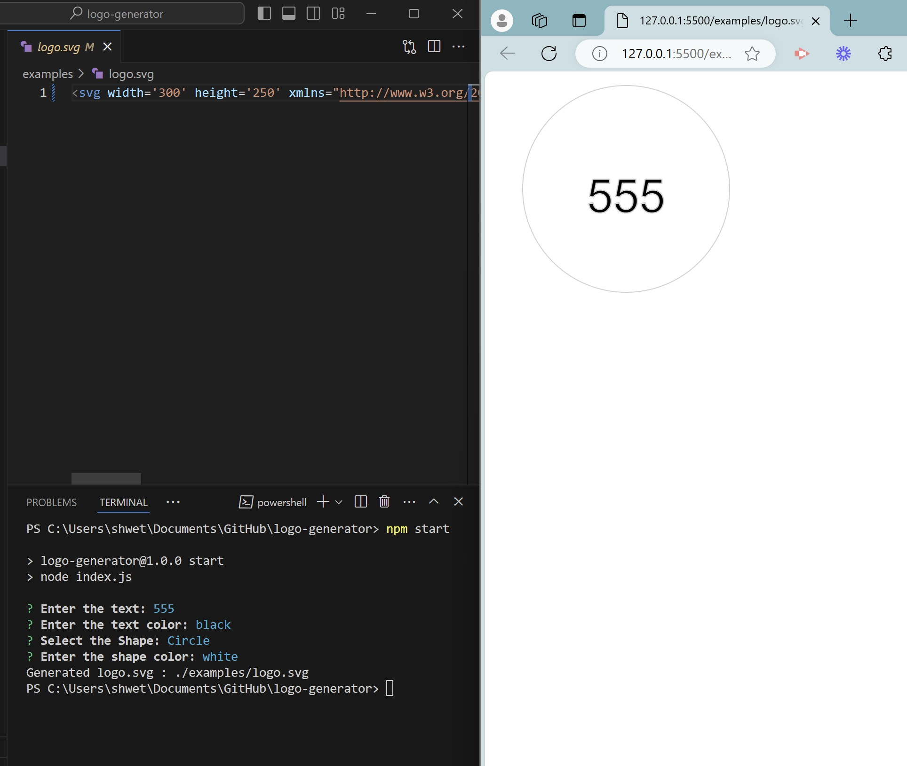
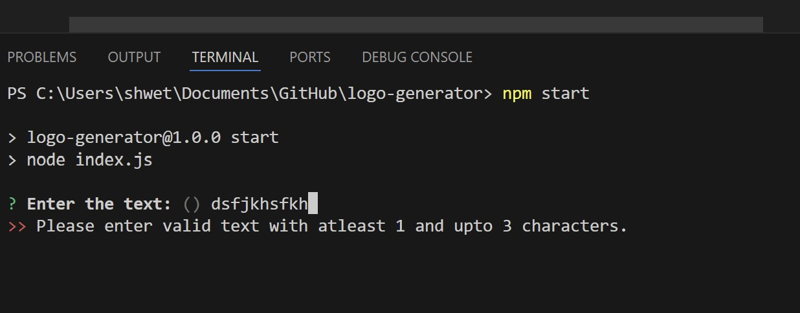
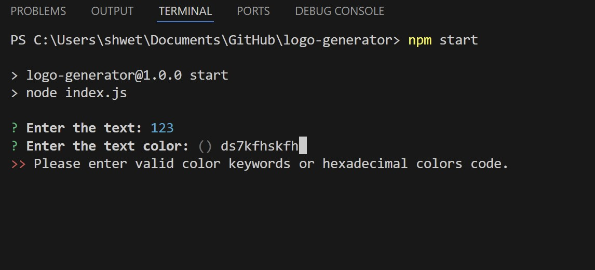
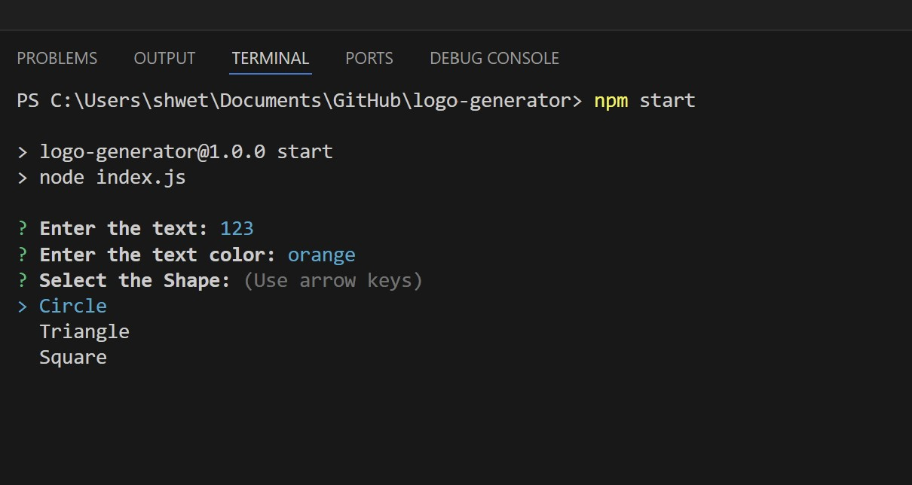
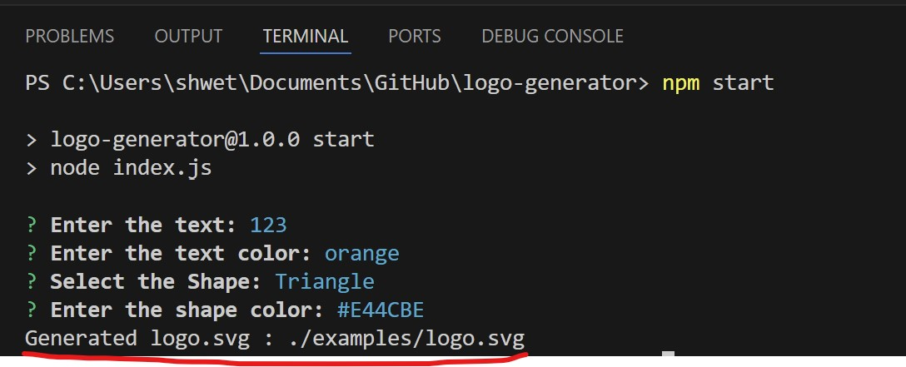
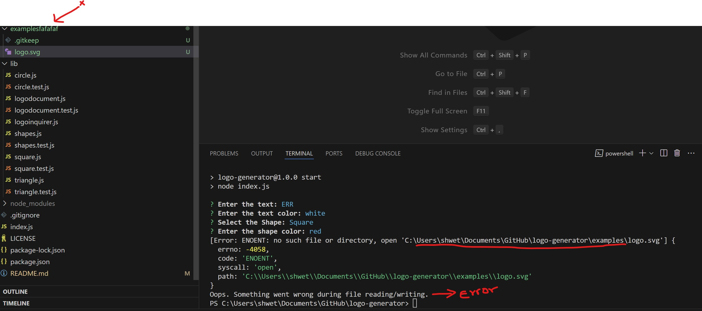
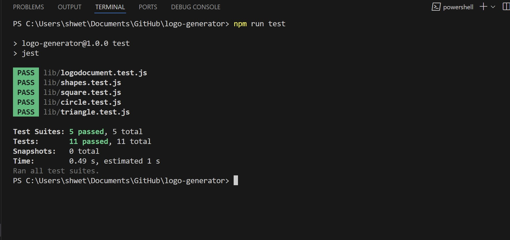

# logo-generator

## Description

- A Logo is symbol with a combination of text and images that helps a user or customer identify brands and differentiate between companies.In its simplest definition, a logo identifies and functions as a face of business/product/company.
- This project is to automate the generation of a LOGO by using a command-line application and save it as an SVG file.
- This allows a free lance developer to generate a simple logo for the project without having to pay for the graphic designer.
- During this implementation, I was able to apply my knowledge on node.js, initialization and installation of npm dependencies, read-write files, modularization, Basic and Advanced inquirer, OOPs concepts of Inheritance and Polymorphism and JEST unit testing.

## Table of Contents 

- [Installation](#installation)
- [User Story](#user-story)
- [Usage](#usage)
- [Usage & Tests](#usageandtest-screenshots)
- [Acceptance Criteria](#acceptance-criteria)
- [Tests](#tests)
- [Credits](#credits)
- [License](#license)

## Installation

Follow these instructions to create your project and deploy it to GitHub Pages:

1. Create a new repository on your GitHub account and clone it to your computer.

2. When you're ready to deploy, use the git add, git commit, and git push commands to save and push your code to your GitHub repository.

3. Navigate to your GitHub repository in the browser and then select the Settings tab on the right side of the page.

4. On the Settings page, select Pages on the left side of the page. On the GitHub Pages screen, choose main in the dropdown under Branch. Click the Save button.

5. Navigate to <your-github-username.github.io/your-repository-name> and you will find that your new webpage has gone live! For example, if your GitHub username is "lernantino" and the project is "css-demo-site", then your URL would be <lernantino.github.io/css-demo-site>.

6. To ensure that the node_modules folder is not pushed in the GITHUB, the .gitignore has to be updated and included.

## User-Story 
```
AS a freelance web developer
I WANT to generate a simple logo for my projects
SO THAT I don't have to pay a graphic designer
```

## Usage

Open the terminal and navigate to the project path **\logo-generator , run the command npm start and answer the questions prompts.
On completion all the questions, a logo.svg file will be generated from the inputs provided by the user.

**Link for the repository :** 

https://github.com/shwetakadam5/logo-generator

**Link for the functionality demo :**
Quick Demo (Important):
https://drive.google.com/file/d/1GhrhuFVs90pUC-1nVJlkTGnpLqt56smA/view?usp=drive_link


## UsageAndTest Screenshots :

#### 1. ****Logo :Circle generated with details provided in the command line:****

 

#### 2. ****Logo :Square generated with details provided in the command line:****

 

#### 3. ****Logo :Triangle generated with details provided in the command line:****

 

#### 4. ****Logo :SVG Dimensions 300 x 250  generated with details provided in the command line:****

 

#### 5. ****Error 1 : Text is required and can be upto three characters:****



#### 6. ****Error 2 : Text and Shape color should be a valid color keyword or 6 character hexadecimal colorcode or 3 character hexadecimal colorcode****

 

#### 7. ****Shapes List 3 : User is presented with shape choices "Circle, Triangle and Square"****

 

#### 8. ****On Successful generation of logo.svg file : message shown on the console:****

 

#### 9. ****Error 3 : If the svg generation folder path is unavailable or incorrect then error displayed  ****

 

## Acceptance-Criteria

```
GIVEN a command-line application that accepts user input
WHEN I am prompted for text
THEN I can enter up to three characters
WHEN I am prompted for the text color
THEN I can enter a color keyword (OR a hexadecimal number)
WHEN I am prompted for a shape
THEN I am presented with a list of shapes to choose from: circle, triangle, and square
WHEN I am prompted for the shape's color
THEN I can enter a color keyword (OR a hexadecimal number)
WHEN I have entered input for all the prompts
THEN an SVG file is created named `logo.svg`
AND the output text "Generated logo.svg" is printed in the command line
WHEN I open the `logo.svg` file in a browser
THEN I am shown a 300x200 pixel image that matches the criteria I entered
```

## Folder-Structure

```md
.  
├── examples/           // Example svg file(s) created with the app
├── lib/                // Folder for classes or functions
    ├── shapes.js       // Parent class
    ├── shapes.test.js  // Jest tests for shapes
    └── logoinquirer.js // User Input And Writing File
    └── logodocument.js // Generation of SVG
    └── more...         // Additional files and tests : Circle, Triangle, Square classes with tests.  
├── .gitignore          // Indicates which folders and files Git should ignore
├── index.js            // Runs the application using imports from lib/
├── package.json
└── README.md           // App description, link to video, setup and usage instructions           
```
## Tests 

Unit Testing was done using JEST

 


## Credits

Inquirer Prompts :
https://www.npmjs.com/package/inquirer/v/8.2.4

Unit Testing :
https://www.npmjs.com/package/jest

## Helpful SVG Resources

* [Example SVG](https://static.fullstack-bootcamp.com/fullstack-ground/module-10/circle.svg)

* [Scalable Vector Graphics (SVG)](https://en.wikipedia.org/wiki/Scalable_Vector_Graphics)

* [SVG tutorial](https://developer.mozilla.org/en-US/docs/Web/SVG/Tutorial)

* [Basic SVG shapes](https://developer.mozilla.org/en-US/docs/Web/SVG/Tutorial/Basic_Shapes)

* [Text in SVG](https://developer.mozilla.org/en-US/docs/Web/SVG/Tutorial/Texts)

* [SVG VS Code extension](https://marketplace.visualstudio.com/items?itemName=jock.svg)


## License

MIT

